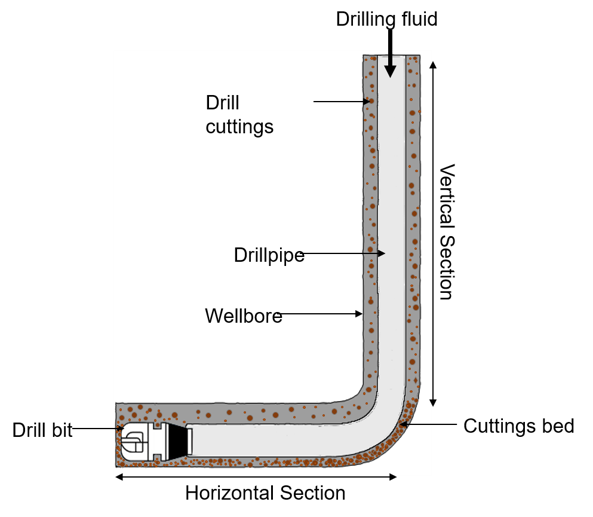

## ML Workflow for the Determination of Hole Cleaning Conditions 
A repo containing the data and Jupyter notebook where ensemble algorithms including RF, GradientBoost and AdaBoost are investigated to attempt predicting the downhole concentration of cuttings in oil wells using surface data. This forms the basis of my submissions for the:
* 2022 SPE Nigeria Students Technical Symposium and Exhibition (STSE) paper contest.
* 2022 SPE Africa Students Paper Contest
* 2022 SPE International Students Paper Contest
---

#### Want to clone this repo?
```sh
git clone https://github.com/awojinrin/ML-Workflow-for-the-Determination-of-Hole-Cleaning-Conditions.git
```
---

### Background Info
With the proliferation of directional and horizontal wells, the ability to model the mechanics of cuttings transport from its downhole origin to the shale shaker is essential in drilling operations since problems observed in vertical trajectories tend to become more complex when encountered in deviated sections. Effective cuttings removal helps optimize the economics of drilling operations and technologies by minimizing concerns such as reduced rate of penetration (ROP), stuck pipe owing to cuttings buildup, high torque, bit balling, excessive equivalent circulating density (ECD), and poor cementing, among others. Optimizing hole cleaning, therefore, involves a complex interplay of fluid rheology parameters, cutting bed features, wellbore properties, and in-situ drilling hardware.

---

### Implemented Workflow  


Using experimental data generated by Yu et al. at the University of Tulsa, this work set out to model cuttings concentration from fluid rheology and wellbore geometric characteristics using several machine learning (ML) techniques accessible as open-source packages in the Python environment. Fluid density, yield point, plastic viscosity, flow rate, temperature, inclination, hole eccentricity, pipe rotation, and ROP were all evaluated as operating variables. The exploratory analysis sought to understand relationships, if any, existing among these variables, and the degree of correlation between these features and the objective. Pearson’s coefficient and the Gini impurity coefficient values suggest that fluid density, flow rate, and pipe rotation were the focal variables influencing our predictions of the concentration of cuttings.  


Several regression algorithms were investigated. Base models were created with default parameters to establish a baseline performance that could be improved upon and were subsequently refined using hyperparameter tuning approaches such as RandomizedSearchCV and GridSearchCV. Mean absolute error (MAE) and coefficient of determination (R2) score served as performance metrics to evaluate model performance, with lower MAE and higher R2 values indicating superior performance.  


Predictions from the model can help the drilling engineer make informed decisions about drilling fluid programs by allowing for a quick and accurate evaluation of hole cleaning conditions.

---

If you got this far, then your tenacity is amazing✨. I'd have zoned off long ago😂

---
[back to top](#ML-Workflow-for-the-Determination-of-Hole-Cleaning-Conditions)
